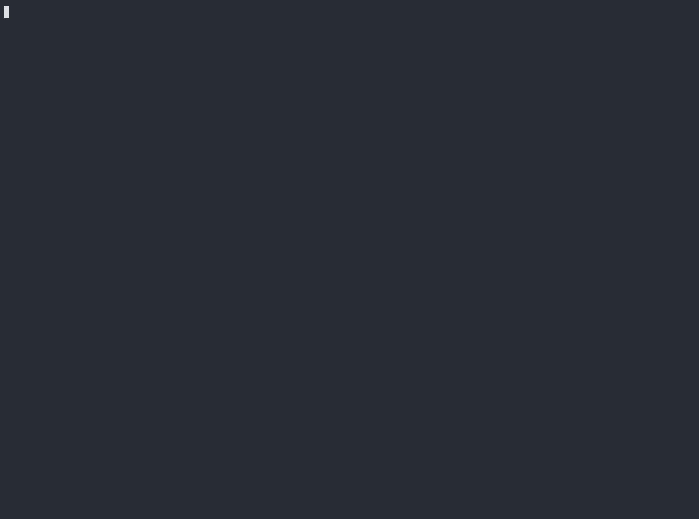

<p align="center">
  
</p>

# refray

A tool to keep your repos in sync across all git platforms, while being able to work from everywhere all at once. 

Created because github is so unusable and [unreliable](https://red-squares.cian.lol/) and I want to leave, but I don't want to leave the community behind.

- **∞-side sync**: Sync between any number of hosted/self-hosted git accounts/orgs/groups
- **read-write mirrors**: Make changes from any provider, and the changes will sync to the others
- **webhook support**: Sync right after push, reduce potential divergence window
- **conflict handling**: Rebase or open pull requests when two platforms diverge
- **tracks state**: Branches/repo deletions and force pushes also sync across platforms (with backup)
- **selective sync**: Sync subset of repos by regex white/black list, or by private/public visibility
- **multithreaded**: Process multiple repos simultaneously!

Supported platforms: GitHub, GitLab, Gitea, Forgejo

> [!NOTE]
> My cat made this codebase, meow



<!--

The demo was rendered from an asciinema cast with capped idle pauses, Sarasa Mono SC, a One Half Dark palette with lighter dark-gray ANSI slots, and a larger font:

```sh
agg --idle-time-limit 1 \
  --theme '282C34,DCDFE4,5C6370,E06C75,98C379,E5C07B,61AFEF,C678DD,56B6C2,DCDFE4,7F848E,E06C75,98C379,E5C07B,61AFEF,C678DD,56B6C2,DCDFE4' \
  --text-font-family 'Sarasa Mono SC' \
  --font-size 24 \
  --cols 160 \
  --rows 42 \
  ../out.cast \
  demo.gif

ffmpeg -i demo.gif \
  -loop 0 \
  -c:v libwebp_anim \
  -lossless 1 \
  -compression_level 6 \
  -q:v 100 \
  docs/demo.webp
```

--->


## Install

### Option 1. Install with Cargo

1. Install rust cargo if you don't have it: https://rustup.rs
2. `cargo install refray`

### Option 2. Download binary

Go to the [releases page](https://github.com/MaigoLabs/refray/releases), find the latest release, and download the appropriate binary for your platform.

### Option 3. Docker Compose

```sh
docker compose run --rm refray config

# Start the webhook receiver as a service
docker compose up -d --build

# If you want to edit config manually:
docker compose run --rm --entrypoint nano refray /data/config/refray/config.toml
```

## Usage

### 1. Configure

Run the interactive configuration wizard:

```sh
refray config
```

<details><summary>Example Config</summary>

```toml
jobs = 8

[[sites]]
name = "github"
provider = "github"
base_url = "https://github.com"
token = { value = "github_pat_..." }

[[sites]]
name = "gitea"
provider = "gitea"
base_url = "https://gitea.example.com"
token = { value = "gitea_pat_..." }

[[mirrors]]
name = "personal"
sync_visibility = "all"
repo_whitelist = "^important-"
repo_blacklist = "-archive$"
create_missing = true
visibility = "private"
conflict_resolution = "auto_rebase_pull_request"

[[mirrors.endpoints]]
site = "github"
kind = "user"
namespace = "hykilpikonna"

[[mirrors.endpoints]]
site = "gitea"
kind = "user"
namespace = "azalea"
```

</details>

### 2. One-time Sync

Run all configured mirror groups:

```sh
refray sync
```

<details><summary>Sync options</summary>

Run one group:

```sh
refray sync --group personal
```

Preview commands without writing to Git remotes:

```sh
refray sync --dry-run
```

Skip repository creation even when `create_missing = true` in the mirror group:

```sh
refray sync --no-create
```

To restrict which repositories sync, set `repo_whitelist` and/or `repo_blacklist` on the mirror group in config.

Retry only repositories that failed during the previous non-dry-run sync:

```sh
refray sync --retry-failed
```

Control parallelism for sync, serve, and webhook commands in config. The default is 10 workers:

```toml
jobs = 8
```

</details>

### 3. Service & Webhooks

You can run `refray` as a service that listens for webhook events and runs full sync periodically. This is the recommended way to run `refray`.

> [!NOTE]
> If you want to use webhooks, you need to expose port 8787 to a public URL that can be accessed by the git provider.<br>
> This can be done using e.g. port forwarding, reverse proxy, cloudflare tunnel, or tailscale funnel.

Start the service (to sync on push and also do full sync periodically):

```sh
refray serve
```

Install webhooks on all repos (with the URL in config):

```sh
refray webhook install
```

To uninstall webhooks previously installed by `refray`:

> [!WARNING]
> If you want to stop using `refray`, make sure you run this! Otherwise, all of your repos will keep trying to send webhooks to the URL.

```sh
refray webhook uninstall
```

By default, uninstall uses `[webhook].url` from your config. To remove hooks for a previous URL, pass it explicitly:

```sh
refray webhook uninstall https://old.example.com/webhook
```

To move installed hooks to a new public URL, use `webhook update`. It removes hooks matching the current configured `[webhook].url`, installs the new URL, updates `[webhook].url` in the config, and refreshes local webhook state:

```sh
refray webhook update https://new.example.com/webhook
```

## Issues and Pull Requests

Issues and pull requests are not mirrored.

## TODO

- [ ] Sync releases and released assets


<!-- ## Sync Semantics

Each mirror group is treated as a set of equivalent namespaces. Repositories are matched by repository name across all endpoints.

Set `sync_visibility = "all"`, `"private"`, or `"public"` on a mirror group to choose which repository visibility is included in that group. When `refray` creates a missing repository, it mirrors the visibility of the existing repository it is syncing from; `visibility` is only a fallback when no source visibility is available.

Set `repo_whitelist = "..."` and/or `repo_blacklist = "..."` on a mirror group to filter repository names with regular expressions. Omit `repo_whitelist` to include all repository names, and blacklist matches are excluded after whitelist matches. These name filters are independent from `sync_visibility`; both must match for a repository to be synced.

For every repository name found in any endpoint, `refray` will:

1. Create missing repositories on the other endpoints when `create_missing = true`.
2. Fetch all branches and tags from each existing endpoint into a local bare mirror cache.
3. Compare branch tips across endpoints.
4. Push the winning branch tip to every endpoint.

Branch conflict handling is intentionally conservative:

- If all endpoints agree on a branch tip, that tip is pushed everywhere.
- If one branch tip is a descendant of the others, the descendant wins and is pushed everywhere.
- If branch tips diverged, `conflict_resolution` controls what happens.

Conflict resolution strategies are configured per mirror group:

- `fail`: fail the repository sync when branch tips diverge.
- `auto_rebase`: rebase divergent commits in endpoint order into one branch history, push fast-forward updates normally, and force-push only endpoints whose original tip was rewritten. If rebase hits a file conflict, fail.
- `pull_request`: push temporary `refray/conflicts/...` branches and open provider pull requests/merge requests so a person can resolve the divergence.
- `auto_rebase_pull_request`: try `auto_rebase` first, then fall back to pull requests if rebase hits a conflict.

GitLab protected branches reject force-pushes unless the protected branch rule allows them. By default, `refray` temporarily enables GitLab project-level force-push permission for protected branches it already knows it must force-push, then restores the prior setting immediately afterward. Set `allow_temporary_gitlab_force_push = false` on a mirror group to disable this behavior.

When a previously opened conflict pull request is merged, the next sync sees the merged branch as the winning tip, pushes it to the other endpoints, and closes stale `refray/conflicts/...` pull requests for that branch.

Force-pushes are propagated only when `refray` can infer intent from the previous successful sync state. If a branch previously matched everywhere, one endpoint rewrites that branch to a non-descendant tip, and the other endpoints still have the previous tip, `refray` writes local backup refs and a bundle under the work-dir `backups/` directory before force-pushing the rewritten tip to the other endpoints. If multiple endpoints rewrite the branch differently, or another endpoint also advances independently, the branch is treated as a conflict and skipped.

Repository and branch deletion are propagated only when it is safe to infer intent, and `refray` writes local backup refs and bundle files under the work-dir `backups/` directory before propagating those deletions. If a repository existed on every endpoint in the previous successful sync, then disappears from one endpoint while the remaining endpoints still have the previous synced refs, `refray` deletes it from the remaining endpoints instead of recreating it when `delete_missing = true`. If `delete_missing = false`, that missing repository is not treated as a deletion and normal missing-repository handling applies. If the repository was deleted everywhere, `refray` removes its saved sync state after creating a local backup from the mirror cache. If the repository was deleted on one endpoint but changed elsewhere, it is treated as a conflict and skipped.

Branch deletion follows the same rule at branch scope: if a branch existed on every endpoint in the previous successful sync, then disappears from one endpoint while the remaining endpoints still have the previous tip, `refray` deletes it from the remaining endpoints instead of recreating it. If the branch was deleted on one endpoint but changed elsewhere, it is treated as a conflict and skipped.

Tags are fetched into provider-specific cache refs and pushed only when the tag object agrees across providers or exists on one side. Divergent tags are skipped and reported. Tag deletion is not propagated.

## Testing

Run the normal, non-destructive test suite:

```sh
cargo test
```

The sequential live e2e test is ignored by default because it creates and deletes repositories on real provider accounts. Configure four token/username pairs in `.env` or the process environment:

```sh
GH_USER=...
GH_TOKEN=...
GL_USER=...
GL_TOKEN=...
GT_USER=...
GT_TOKEN=...
FO_USER=...
FO_TOKEN=...
```

Optional base URL overrides are `GL_BASE_URL`, `GT_BASE_URL` or `GITEA_BASE_URL`, and `FO_BASE_URL` or `FORGEJO_BASE_URL`. The Gitea and Forgejo defaults are `https://gitea.com` and `https://codeberg.org`.

Run the destructive e2e test explicitly:

```sh
REFRAY_E2E_ALLOW_DESTRUCTIVE=1 \
  cargo test --test sequential -- --ignored --test-threads=1 --nocapture
```

By default cleanup only deletes repositories named `refray-e2e-*`. To start by deleting every owned repository visible to the configured accounts, set `REFRAY_E2E_CLEAR_ALL_REPOS=DELETE_ALL_OWNED_REPOS`. Provider skips (`REFRAY_E2E_SKIP_GITHUB`, `REFRAY_E2E_SKIP_GITLAB`, `REFRAY_E2E_SKIP_GITEA`, `REFRAY_E2E_SKIP_FORGEJO`) and `REFRAY_E2E_ALLOW_PARTIAL=1` are available for local debugging, but the full support check should run with all four providers. -->
